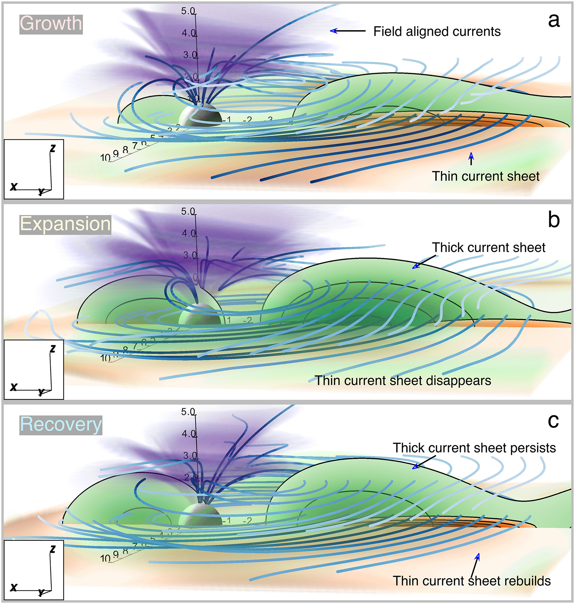

# ARGUS (AI-based Reconstruction of the Geospace Unified System)
Source code for ARGUS (AI-based Reconstruction of the Geospace Unified System). The principal part is the FORTRAN source code for the [Stephens et al. (2019)](https://doi.org/10.1029/2018JA025843), termed SST19, and the TS07D empirical geomagnetic field models. The architecture of SST19 extends that of the TS07D model [(Tsyganenko & Sitnov, 2007)](https://doi.org/10.1029/2007JA012260), which was the first data mining-based algorithm for reconstructing the storm-time magnetospheric geomagnetic field [(Sitnov et al., 2008)](https://doi.org/10.1029/2007JA013003). SST19 and TS07D owe their heritage to the many [Tsyganenko geomagnetic field models](https://geo.phys.spbu.ru/~tsyganenko/empirical-models/).

# About

# Getting Started
The model source code is self-contained, requiring no external dependencies or libraries. The model was developed on a Mac using [GFortran](https://gcc.gnu.org/wiki/GFortran).

## SST19
To get started, try compiling the sample program, sst19_example_june2023.for, included in the source code. First, on the command line, move into the directory where the SST19 model code is located: `cd src/sst19`.

Assuming GFortran is [installed](https://gcc.gnu.org/wiki/GFortranBinaries), the sample program can be compiled using the following: 
`gfortran sst19_example_june2023.for sst19_field.f read_sst19.f fac_total_sst19.f ../deformedsheet_with_tcs.f ../dipoleshield.f ../fac_field.f ../fac_shield.f ../deformbirkfield.f ../stretchfield.f ../one_cone.f ../one_cone_smooth.f ../conical.f90 ../tailsheet_shielded.f ../tailsheet_sym.f ../tailsheet_asym.f ../bendfield.f ../warpfield.f ../cartharmonic.f ../cartharmonic_alt.f ../cylharmonic.f ../rotate_about_y.f ../bessjj.f -o sst19_example_june2023`

This will compile the example program contained in the file `sst19_example_june2023.for` into an executable file named `sst19_example_june2023`.

The executable can then be run on Unix systems using `./sst19_example_june2023`. The output of this program should produce:

>    shielding coefficients have been stored\
  External field evaluated at: (xGSM,yGSM,zGSM)=  -5.0000000000000000        4.2000000000000002        1.2000000000000000     \
  Expected:  (bxGSM,byGSM,bzGSM)=   16.702390096106559       -13.306583526317164       -36.650180176716844       nT\
  Evaluated: (bxGSM,byGSM,bzGSM)=   16.702390096106559       -13.306583526317164       -36.650180176716844       nT

## TS07D
To get started, try compiling the sample program, ts07d_example_june2023update.for, included in the source code. First, on the command line, move into the directory where the TS07D model code is located: `cd src/ts07`.

Assuming GFortran is [installed](https://gcc.gnu.org/wiki/GFortranBinaries), the sample program can be compiled using the following: 
`ts07d_example_june2023update.for ts07_field.f read_ts07.f fac_total_ts07.f ../deformedsheet.f ../dipoleshield.f ../fac_field.f ../fac_shield.f ../deformbirkfield.f ../stretchfield.f ../one_cone.f ../one_cone_smooth.f ../conical.f90 ../tailsheet_shielded.f ../tailsheet_sym.f ../tailsheet_asym.f ../bendfield.f ../warpfield.f ../cartharmonic.f ../cartharmonic_alt.f ../cylharmonic.f ../rotate_about_y.f ../bessjj.f -o ts07d_example_june2023update`

This will compile the example program contained in the file `ts07d_example_june2023update.for` into an executable file named `ts07d_example_june2023update`.

The executable can then be run on Unix systems using `./ts07d_example_june2023update`.

The TS07D model input files have been precomputed for 1995--2018 which are available on [Zenodo](https://doi.org//10.5281/zenodo.14733740).

# FAQs
None as of yet.

# License
[3-Clause BSD](LICENSE)

# Author
Grant K. Stephens
Grant.Stephens@jhuapl.edu
[Webpage](https://civspace.jhuapl.edu/people/grant-stephens)
[Twitter](https://twitter.com/GrantKStephens)

Mikhail I. Sitnov

Nikolai A. Tsyganenko
[Webpage](https://geo.phys.spbu.ru/~tsyganenko/empirical-models/)

# Acknowledgments
Add.

